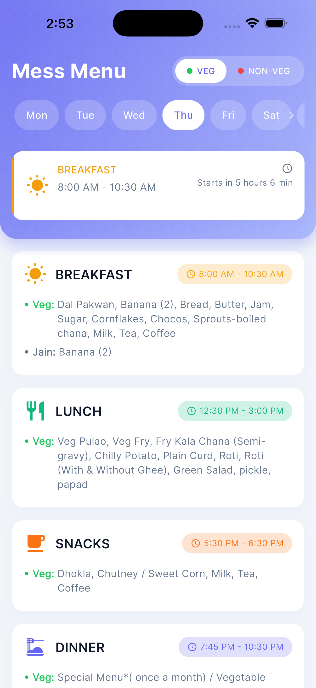
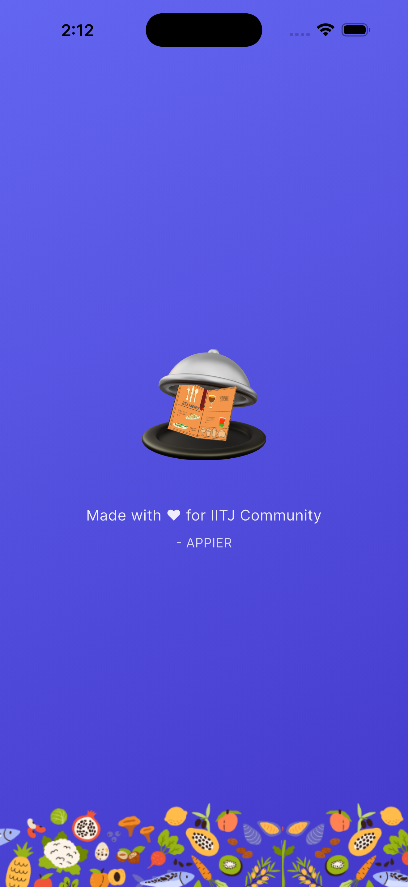

# 🍽️ IITJ Menu App

<div align="center">


**A modern, intuitive mess menu application for the IIT Jodhpur community.**

Developed by **Om Tathed** (M.Tech Quantum Technologies)

</div>

---

## 📱 Overview

**IITJ Menu** is a dedicated mobile application designed to help students, faculty, and staff at IIT Jodhpur easily access daily mess menus. Built with Flutter and Firebase, it offers a seamless experience with offline support, dietary filtering, and a beautiful Material 3 design.

## ✨ Features

- **📅 Daily Menu Display**: View Breakfast, Lunch, Snacks, and Dinner menus for the entire week.
- **⚡ Real-time Updates**: Menu changes are updated instantly via Firebase Remote Config.
- **💾 Offline Support**: Smart caching ensures the menu is available even without internet.
- **🥗 Dietary Filtering**: Easily toggle between Veg, Non-Veg, and Jain options.
- **🌗 Dark/Light Mode**: Full support for system themes and manual toggling.
- **🔔 Smart Indicators**: Visual cues for the current active meal and upcoming meals.
- **📱 Cross-Platform**: Native performance on both Android and iOS.

## 🛠️ Tech Stack

- **Framework**: [Flutter](https://flutter.dev/)
- **Language**: [Dart](https://dart.dev/)
- **Backend/Config**: [Firebase Remote Config](https://firebase.google.com/docs/remote-config)
- **State Management**: [Provider](https://pub.dev/packages/provider)
- **Local Storage**: [Hive](https://pub.dev/packages/hive)

## 📸 Screenshots

| Home Screen (Light) | Home Screen (Dark) | Meal Details |
|:---:|:---:|:---:|
|  |  |  |

*(Note: Screenshots to be added)*

## 🚀 Getting Started

### Prerequisites

- Flutter SDK (3.0.0 or higher)
- Dart SDK
- Android Studio / VS Code
- Git

### Installation

1.  **Clone the repository**
    ```bash
    git clone https://github.com/YOUR_USERNAME/iitj_menu.git
    cd iitj_menu
    ```

2.  **Install dependencies**
    ```bash
    flutter pub get
    ```

3.  **Run the app**
    ```bash
    flutter run
    ```

## 🔒 Privacy & Support

- **[Privacy Policy](PRIVACY_POLICY.md)**
- **[Support](SUPPORT.md)**

## 👨‍💻 Developer

**Om Tathed**  
M.Tech Quantum Technologies  
IIT Jodhpur  
📧 [m25iqt009@iitj.ac.in](mailto:m25iqt009@iitj.ac.in)

---
Made with ❤️ for the IITJ Community
